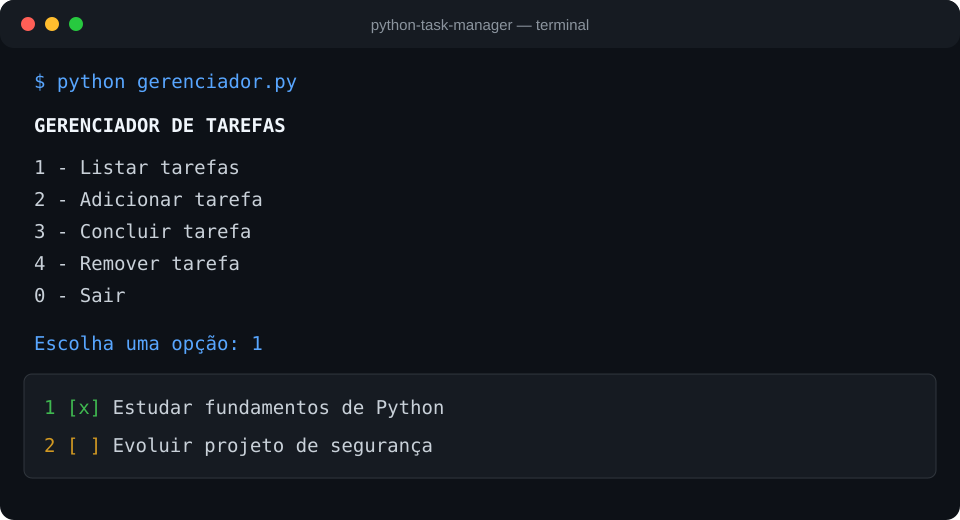

<div align="center">

# ✅ Python Task Manager

Gerenciador de tarefas executado no terminal, com persistência em JSON e testes automatizados.


</div>

## Sobre o projeto

Aplicação de terminal para cadastrar, listar, concluir e remover tarefas. Os dados são armazenados localmente em JSON e permanecem disponíveis entre execuções.

## Funcionalidades

- Cadastro de tarefas
- Listagem com indicação de status
- Conclusão de tarefas por ID
- Remoção de tarefas por ID
- Persistência local em JSON
- Validação de entradas
- Testes automatizados com `unittest`

## Estrutura

```text
python-task-manager/
├── gerenciador.py
├── test_gerenciador.py
└── README.md
```

## Como executar

```powershell
python gerenciador.py
```

## Como testar

```powershell
python -m unittest test_gerenciador.py -v
```

## Demonstração visual

> Fluxo real da aplicação apresentado em um terminal limpo para facilitar a leitura.



## Exemplo do menu

```text
Gerenciador de tarefas
1 - Listar tarefas
2 - Adicionar tarefa
3 - Concluir tarefa
4 - Remover tarefa
0 - Sair
```

## Conceitos aplicados

`Python` · `Programação orientada a objetos` · `JSON` · `Pathlib` · `Tratamento de exceções` · `Testes automatizados`

## Próximas melhorias

- Adicionar prazos e prioridades
- Criar filtros de tarefas
- Implementar interface gráfica ou web

---

Desenvolvido por [Nicolas Marques](https://github.com/NicolasMarquesSousa).